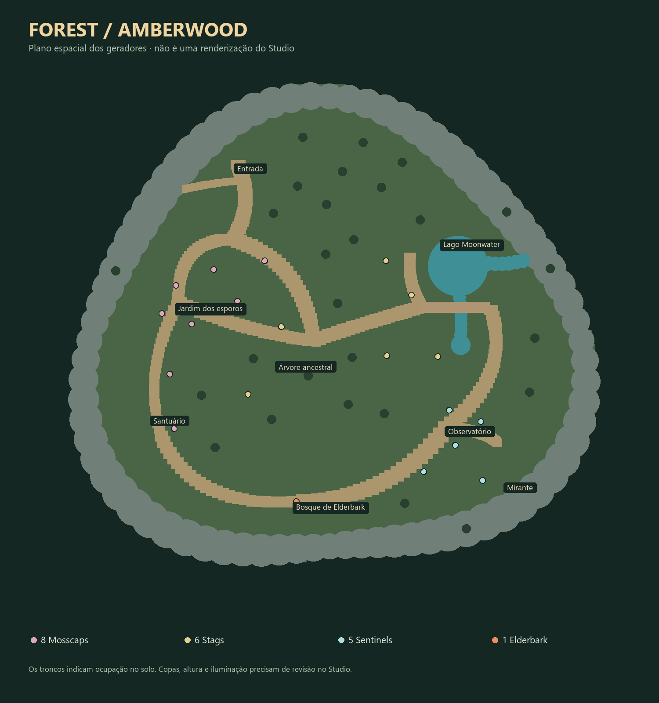
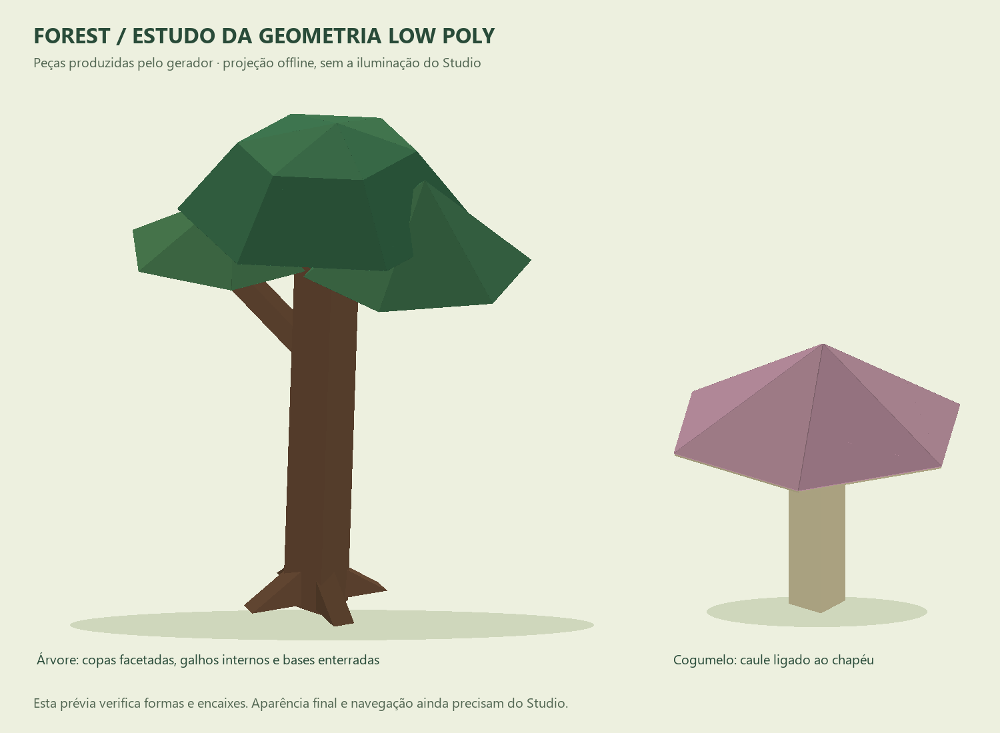

# Forest — low poly v4

> **Conteúdo atualizado:** drops, receitas, equipamentos e passivas foram revisados depois desta documentação de mundo. Use `Info/Forest-content.md` como fonte atual para gameplay; as seções antigas de drops/passivas abaixo são apenas histórico da primeira versão.

## Aplicar no Studio

Com Play parado, cole o conteúdo completo de `tools/world-generators/09_InstallForest.luau` na Command Bar. O instalador executa 04, 05, 06, 07 e a auditoria 08, nessa ordem. Sincronize Common pelo Rojo, salve o place e entre na Forest pelo seletor de zonas.

As versões substituídas do mapa, rigs, spawns, regiões, iluminação e assets ficam em `ServerStorage.WorldGeneratorBackups`. O instalador não publica o jogo. Se uma etapa falhar, confira o Output: etapas anteriores podem já ter sido aplicadas, e os backups permanecem disponíveis. Não execute em Play.

Os arquivos 04–08 continuam independentes. Após alterar os fontes, execute `python tools/build_forest_installer.py` para atualizar 09. Depois de mover o mapa ou girá-lo em Y, reexecute 06. Alterações de escala ou relevo exigem revisar os marcadores e a altura do chão.

## Direção visual e espaço

Construção low poly com cores chapadas e copas de faces triangulares contínuas. Troncos começam abaixo da superfície, raízes em cunha têm bases enterradas e os galhos terminam dentro das copas. Árvores dos paredões são plantadas na altura da rocha de apoio. Cogumelos têm um chapéu hexagonal único, caule ligado à parte inferior e proporções menores no cenário.

A entrada foi deslocada para o sudoeste. O caminho bifurca entre o jardim de cogumelos e a clareira da árvore ancestral; segue para a ponte, o observatório e o bosque do boss. Uma rota lateral pelo santuário fecha o circuito. O lago é um desvio de exploração, e o mirante tem acesso próprio. Foram removidas as ligações diretas que faziam a árvore central funcionar como um cruzamento de várias trilhas.

O observatório tem uma planta de pavilhão: fundações, colunas e parede posterior seguem os mesmos eixos. As barras luminosas e o círculo de marcas da arena foram removidos. O piso de combate continua nivelado, e água, encontros e caminhos mantêm áreas reservadas antes da colocação da vegetação.

O mapa reserva trilhas, água, marcos e áreas de encontro **antes** de distribuir árvores e decoração. A colocação usa rejeição por distância e tamanho de ocupação. Junções deliberadas entre peças de troncos, copas e rochas fazem parte da modelagem; a auditoria procura obstáculos nos espaços jogáveis.

## Spawns e rigs

A população foi reorganizada de 28 para **20 encontros**: 8 Mosscaps, 6 Thornback Stags, 5 Hollow Sentinels e 1 Elderbark. A entrada fica fora dos raios iniciais de aggro. Os espaços de combate têm reserva de vegetação; o boss mantém a região de 112 × 70 × 112 e o combate existente. HP, recompensas, receitas, IDs de itens e persistência não foram alterados.

`Workspace.Maps.Forest.EncounterMarkers` é a fonte das posições de spawn. Cada marcador tem `Species` e `ClearanceRadius`. O gerador 06 usa esses pontos exatos, calcula a altura pelo rig e rejeita chão incorreto, água, obstáculos físicos e pontos muito próximos. Não desloca silenciosamente um encontro para outro lugar. Ao editar encontros manualmente, preserve o espaço da área e atualize as contagens da auditoria se alterar a população.

Os quatro rigs mantêm nomes, pivôs e juntas da infraestrutura existente. Membros e galhos retornam às formas angulares e materiais lisos; Mosscap recebe um chapéu facetado fechado, sem camadas de elipsoides ou manchas soltas. Motor6D articula membros e WeldConstraint acompanha os detalhes. Não foram criadas animações esqueléticas publicadas.

| Conteúdo | Local |
|---|---|
| Mapa editável | Workspace.Maps.Forest |
| Planejamento dos encontros | Workspace.Maps.Forest.EncounterMarkers |
| Rigs | ReplicatedStorage.Mobs.Forest |
| Spawns instalados | Workspace.MobSpawns.Forest |
| Região de iluminação | Workspace.ZoneRegions.Forest |
| Limite do boss | Workspace.ZoneRegions.Elderbark Heartgrove |
| Contador de respawn | Workspace.BossRespawns.Forest.Elderbark |
| Iluminação editável | ReplicatedStorage.Resources.LightingTemplates.Forest |
| VFX de combate | ReplicatedStorage.Resources.CombatVFX.Attacks |
| Armas equipáveis | ReplicatedStorage.Resources.Weapons |
| Stats e drops | Common/src/Shared/MobsData/Forest |

## Iluminação e validação

O template regional usa tarde quente, sombras frias, névoa moderada e bloom discreto. Os efeitos continuam editáveis em `LightingTemplates.Forest`. O sistema existente aplica o template ao entrar na região e restaura o padrão ao sair. A geração não altera o Lighting global em Edit; para avaliar a iluminação final, entre na Forest em Play.

- `python tools/verify_forest_world.py --luau <luau.exe>` executa os geradores reais com CFrames e caixas orientadas simuladas. Verifica rotas, água, spawns, chão, conexões dos rigs e integração dos assets.
- `--reinstall --transform --seed-offset 371` verifica reinstalação com backup e mapa deslocado/girado, com outra distribuição de vegetação.
- `--plan Info/Forest-layout.png` exporta o plano espacial offline (requer Pillow). Não é uma captura do Studio.
- `--models-preview Info/Forest-models.png` projeta a geometria real gerada de uma árvore e um cogumelo para inspeção (Pillow e NumPy). Não simula os materiais ou a iluminação do Studio.
- `python tools/build_forest_installer.py --check` verifica se o instalador está atualizado.
- `08_ForestAudit.luau` executa consultas reais de geometria no Studio. O gerador aleatório do harness é diferente do Roblox; a auditoria em Edit continua necessária.
- A auditoria também verifica apoio sob troncos, bases enterradas e conexão das raízes com o tronco.

Ainda precisam de Studio: aparência em câmera de jogador, gráficos altos/baixos, desempenho com todos os mobs, passagem na ponte e na rampa, perseguição e retorno dos mobs, leitura de avisos sob a iluminação, animações, combate de Elderbark, respawn e transição para outras zonas. Os testes offline não atestam qualidade visual ou física do Roblox.

## Combate ativo

Valores iniciais, antes de defesa; ainda precisam de balanceamento jogado.

| Mob | N?vel | HP | Ataque | Defesa | Velocidade | XP / Gold | Respawn |
|---|---:|---:|---:|---:|---:|---|---|
| Mosscap | 16 | 280 | 17 | 3 | 11 | 340 / 32 | 10 s |
| Thornback Stag | 19 | 410 | 22 | 4 | 18 | 460 / 42 | 11 s |
| Hollow Sentinel | 22 | 620 | 27 | 7 | 10 | 620 / 55 | 13 s |
| Elderbark | 25 | 6500 | 38 | 9 | 9 | 3200 / 400 | 120 s |

B?sicos comuns t?m aviso de 0,65 s; Elderbark usa 0,85 s. Todos os ataques usam os indicators existentes e dano autoritativo de CombatContext. A margem de hitbox j? existente ? de 1 stud por lado; altura de dano m?nima de 40 studs: esquivar lateralmente ? o recurso confi?vel, n?o pular sobre o aviso.

- **Mosscap / SporeBloom:** anuncia dois c?rculos fixos no in?cio. Impactos em 1,2 s (raio 7) e 2 s (raio 10). Sair da ?rea maior evita ambos. Um alvo recebe no m?ximo um acerto de 1,2? por uso, inclusive se cruzar as duas ondas. Recarga 9 s, alcance de ativa??o 14.
- **Stag / AntlerRush:** aviso frontal 8?32 por 1,3 s. Corre 26 studs a 30 studs/s, dire??o travada, para em obst?culos. Acerto ?nico de 1,4?, knockback 35. Recupera??o de 0,9 s ap?s a corrida permite contra-atacar. Recarga 10 s, alcance 30.
- **Sentinel / RootLanes:** duas faixas frontais 10?28, separadas por uma faixa central estreita. Esquerda explode em 1,1 s, direita em 1,8 s, ambas anunciadas no in?cio. ? poss?vel trocar para a metade j? atingida. Cada faixa causa 0,8? uma vez por jogador. Recarga 11 s, alcance 28.
- **Elderbark / HeartSlam:** c?rculo fixo de raio 18, aviso 1,5 s, dano 1,5? e knockback 35; recarga 14 s.
- **Elderbark / MarkedRoots:** marca at? tr?s jogadores vivos mais pr?ximos a at? 55 studs, fixa as posi??es e avisa por 1,6 s. C?rculos de raio 6 causam 1,2?; sobreposi??es compartilham deduplica??o. Sair da posi??o marcada evita o ataque. Recarga 16 s.
- **Elderbark / RootSweep:** faixa frontal 26?20, aviso 1,2 s, dano 1,4?; recarga 13 s. Recompensa posicionamento lateral/traseiro.

Elderbark alterna as habilidades dispon?veis respeitando alcance, recarga e **5 s de intervalo global ap?s cada habilidade**, usando b?sicos entre elas. Mobs comuns t?m intervalo global de 2 s. O Controller conserva o comportamento anterior para mobs sem SkillRecovery. Reset/death cancela a sess?o; ataques n?o mant?m tarefas independentes de dano ap?s cancelamento. Ranges e leashes evitam persegui??o pela zona inteira. A regi?o quadrada do boss mede 112?70?112; o Controller reinicia o boss quando n?o h? alvo eleg?vel nela.

N?o h? invulnerabilidade, cura infinita, veneno escondido, enrage ou invoca??es nesta vers?o. Os efeitos mostram os ataques; anima??es esquel?ticas publicadas espec?ficas dos rigs ainda precisam ser produzidas. VFX tem dura??o limitada, descarte por dist?ncia e cleanup pela infraestrutura existente.

## Drops e crafting ativos

Drops usam o pipeline existente: apenas participantes registrados em HitList recebem recompensas. N?o h? recompensa global. Cada material comum tem chance de 75%, quantidade 1; Elderbark fornece 3 Elder Heartwood garantidos.

| Item / ID exato | Fonte | Craft?vel? | Receita ativa |
|---|---|---|---|
| Spore Silk | Mosscap, 75% | N?o | Ingrediente |
| Thorn Antler | Stag, 75% | N?o | Ingrediente |
| Runic Bark | Sentinel, 75% | N?o | Ingrediente |
| Elder Heartwood | Elderbark, 3 garantidos | N?o | Ingrediente |
| Sporeweave Mantle | Blacksmith, n?vel 16 | Sim | 12 Spore Silk + 4 Runic Bark + 220 Gold |
| Thornwood Blade | Blacksmith, n?vel 18 | Sim | 10 Thorn Antler + 6 Runic Bark + 300 Gold |
| Bramble Loop | Stag, 6% | N?o | Drop exclusivo |
| Moonwater Pendant | Sentinel, 5% | N?o | Drop exclusivo |
| Runebark Vestment | Blacksmith, n?vel 23 | Sim | 16 Runic Bark + 8 Spore Silk + 450 Gold |
| Heartwood Cleaver | Blacksmith, n?vel 25 | Sim | 8 Elder Heartwood + 12 Thorn Antler + 700 Gold |
| Heart of the Grove | Elderbark, 12% | N?o | Drop exclusivo |

Crafting usa a valida??o, trava por jogador e consumo de materiais/Gold existentes no servidor. Sem mudan?as de schema ou IDs. Todos os itens continuam sem ?cone. As armas geradas t?m Handle e GripPoint, compat?veis com WeaponLoader. As armaduras/acess?rios usam seus stats; n?o foram criados cosm?ticos corporais.

## Passivas de equipamento ? futuras, n?o ativas

Todos os equipamentos Forest ainda t?m `Passive = ""`. Propostas para uma etapa dedicada: Deep Roots no Heartwood Cleaver (quinto acerto +5 Attack); Barkskin na Runebark Vestment (primeiro dano -15%, recarga 12 s); Renewal no Heart of the Grove (sexto acerto recupera 3% HP). Revisar intera??o com passivas atuais e impedir reset abusivo por reequipar antes de implementar. Descri??es dos itens n?o prometem esses efeitos.

## Verifica??o

`tools/verify_forest_combat.py --luau <caminho>` executa os m?dulos reais de ataque com mocks: cancelamento, deduplica??o, ordem das faixas, sele??o de tr?s alvos, corrida bloqueada, behaviors, drops e receitas. O compilador Luau valida sintaxe/bytecode. Isso n?o substitui Studio.

Playtest pendente: spawns com p?s no ch?o, persegui??o entre ?rvores, hitboxes/avisos, ataques contra obst?culos, morte durante windup e corrida, sobreposi??o de ra?zes com dois jogadores, boss bar, reset ao sair da arena, timer de 120 s, recompensas somente para participantes e crafting com invent?rio cheio/materiais insuficientes. Conferir grip e anima??es das armas, leitura dos VFX sob a ilumina??o e retorno ? Grasslands sem regress?o.

Boar continua com Attack 9 e Wolf 14; esta integra??o n?o altera essa corre??o.
